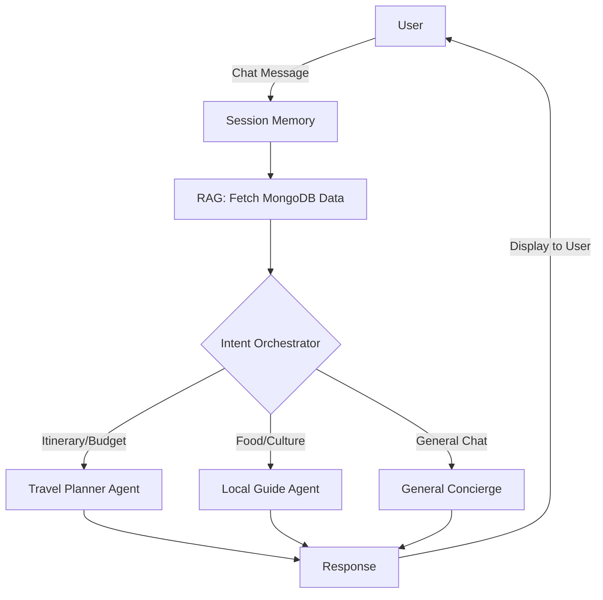

<div align="center">
  
  
  
  
  
</div>

<h1 align="center">YatraAI 🇮🇳✈️</h1>

<p align="center">
  <strong>Discover India's finest hotels with an embedded Multi-Agent AI Travel Concierge.</strong><br>
  <a href="https://yatraai-ihpw.onrender.com">View Live Demo</a>
</p>

---

## 📸 Platform Preview

Here is a live screenshot of the deployed YatraAI platform:

<div align="center">
  
</div>

---

## 🧠 Agentic AI Workflow

YatraAI is not just a standard booking platform; it features a sophisticated **Multi-Agent Orchestration System** powered by OpenAI. This system eliminates hallucinations by injecting real database records into the AI prompts.

### How it Works (The Agentic Pipeline)
1. **User Input:** The user types a message in the global chat widget.
2. **Memory Manager:** The system retrieves the user's session history (sliding window) for context.
3. **RAG Pipeline (Retrieval-Augmented Generation):** The backend queries MongoDB for the currently viewed hotel and other available hotels in the same city.
4. **The Orchestrator:** A lightweight intent classifier analyzes the message and routes it to the appropriate specialist agent:
   - 🗺️ **Travel Planner Agent:** Handles day-by-day itineraries, budget estimations, and weather advice.
   - 🍽️ **Local Guide Agent:** Handles highly specific food, sightseeing, and cultural recommendations near the current hotel using exact coordinates.
5. **Contextual Response:** The chosen agent generates a highly accurate response using the real hotel data, completely preventing AI hallucination.



---

## ✨ Core Features

- **🤖 Conversational AI Concierge:** Integrated multi-agent assistant capable of generating accurate, data-backed travel plans.
- **🗺️ Interactive Maps:** Real-time location tracking and routing using the Leaflet Geolocation API.
- **🔐 Secure Authentication:** Robust user authentication (Signup/Login) with Passport.js and secure session storage.
- **☁️ Cloud Image Hosting:** Seamless property image uploads managed via Cloudinary integration.
- **🎨 Premium UI/UX:** Responsive, modern interface featuring glassmorphism, dynamic flash toasts, and a mobile-first design.

---

## 🛠️ Tech Stack

### Backend
- **Runtime:** Node.js
- **Framework:** Express.js
- **Database:** MongoDB (Mongoose ORM)
- **Authentication:** Passport.js, Express-Session
- **File Uploads:** Multer, Cloudinary

### Frontend
- **Templating:** EJS (Embedded JavaScript), EJS-Mate
- **Styling:** Custom CSS (CSS Variables, Flexbox, CSS Grid)
- **Maps:** Leaflet.js

---

## 🚀 Local Installation

Follow these steps to run YatraAI on your local machine.

### 1. Clone the repository
```bash
git clone https://github.com/PayalMohanapure/YatraAI.git
cd YatraAI
```

### 2. Install dependencies
Navigate to the backend directory and install all required NPM packages:
```bash
cd BACKEND
npm install
```

### 3. Configure Environment Variables
Create a `.env` file in the `BACKEND` directory and add your secret keys. **Never commit this file to GitHub.**
```env
PORT=8080
MONGODB_URL=your_mongodb_connection_string
SECRET=your_express_session_secret
CLOUD_NAME=your_cloudinary_name
CLOUD_API_KEY=your_cloudinary_api_key
CLOUD_API_SECRET=your_cloudinary_api_secret
OPENAI_API_KEY=your_openai_api_key
```

### 4. Run the Server
```bash
node app.js
```
The application will be running at `http://localhost:8080`.

---

## 📂 Project Structure

```text
YatraAI/
├── AGENTIC_AI/         # Multi-Agent Logic & OpenAI Integration
│   ├── config.js
│   ├── localGuideAgent.js
│   ├── memory.js
│   ├── orchestrator.js
│   ├── places.js
│   ├── rag.js
│   ├── travelPlannerAgent.js
│   └── package.json
├── BACKEND/            # Express.js Server & Business Logic
│   ├── controllers/    # Route controllers (MVC)
│   │   ├── ai.js
│   │   ├── listings.js
│   │   ├── reviews.js
│   │   └── users.js
│   ├── init/           # Database seed scripts
│   │   ├── data.js
│   │   └── index.js
│   ├── models/         # Mongoose Schemas
│   │   ├── listing.js
│   │   ├── review.js
│   │   └── user.js
│   ├── routes/         # Express router endpoints
│   │   ├── ai.js
│   │   ├── listings.js
│   │   ├── reviews.js
│   │   └── users.js
│   ├── scripts/
│   │   └── fetch-osm.js
│   ├── app.js          # Entry point
│   ├── cloudConfig.js  # Cloudinary configuration
│   ├── middleware.js   # Auth & Validation middleware
│   └── package.json
└── FRONTEND/           # Client-side code & EJS Views
    ├── public/         
    │   ├── css/
    │   │   └── style.css
    │   └── js/
    │       ├── booking.js
    │       ├── chat.js
    │       └── map.js
    └── views/          
        ├── layouts/
        │   └── boilerplate.ejs
        ├── listings/
        │   ├── edit.ejs
        │   ├── index.ejs
        │   ├── new.ejs
        │   └── show.ejs
        ├── pages/
        │   ├── about.ejs
        │   └── contact.ejs
        ├── users/
        │   ├── login.ejs
        │   ├── profile.ejs
        │   └── signup.ejs
        └── error.ejs
```

---

<div align="center">
  <i>Built with ❤️ for seamless travel planning across India.</i>
</div>
